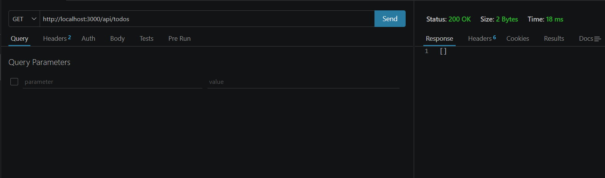
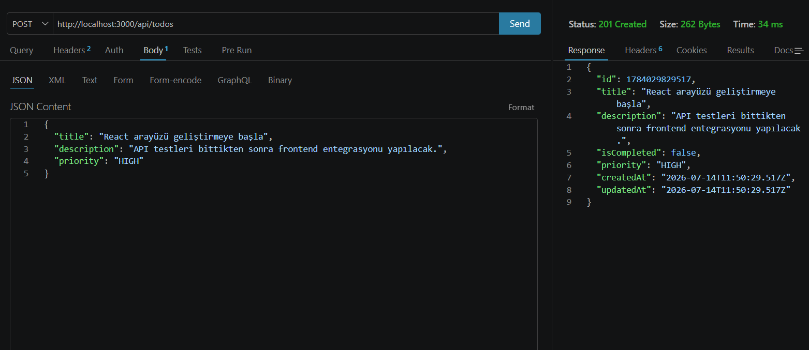
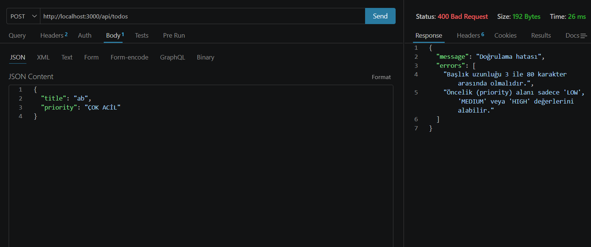
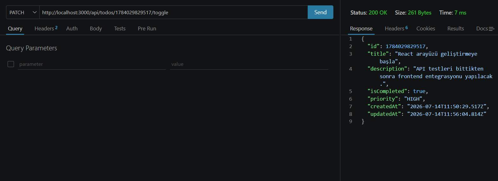
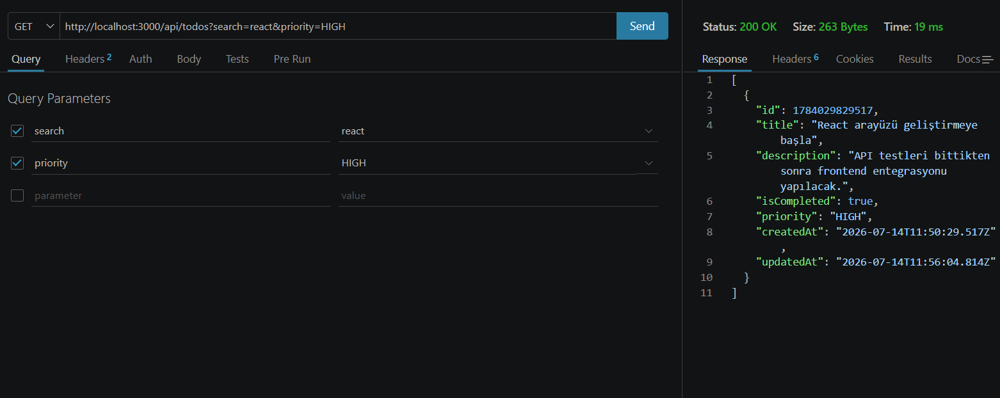
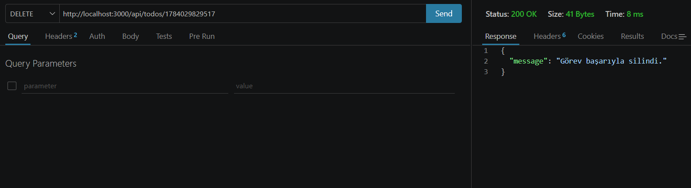

# Mini Todo REST API

Node.js, Express.js ve React kullanılarak geliştirilmiş, katmanlı mimariye (Layered Architecture) sahip tam teşekküllü bir Full Stack Todo uygulamasıdır. Bu proje, modern backend mühendisliği prensiplerini ve dinamik bir Tek Sayfa Uygulaması (SPA) olan şık bir arayüzü bir araya getirir.

## 🚀 Özellikler

### Backend (Node.js & Express.js)
- **Katmanlı Mimari:** Route, Controller, Service ve Repository katmanlarının birbirinden net bir şekilde ayrılması sayesinde sürdürülebilir ve test edilebilir kod yapısı.
- **Kalıcı Veri Saklama (JSON):** Veriler uçucu bellek (in-memory) yerine, `fs` modülü kullanılarak kalıcı olarak `todos.json` dosyasına güvenli bir şekilde kaydedilir.
- **Gelişmiş Filtreleme:** Görevler `status` (tamamlanan/aktif), `priority` (HIGH, MEDIUM, LOW) ve `search` (başlıkta arama) parametrelerine göre filtrelenebilir.
- **Sıralama ve Sayfalama:** `page` ve `limit` kullanılarak sayfalama (pagination) yapılırken; `sortBy` ve `sortOrder` ile görevler oluşturulma tarihi veya önceliğine göre dinamik olarak sıralanabilir.
- **Güçlü Validasyon:** Başlık (3-80 karakter) ve öncelik (LOW/MEDIUM/HIGH) alanları servis katmanında doğrulanır. Hatalı durumlarda açıklayıcı JSON hata mesajlarıyla `400 Bad Request` dönülür.
- **Merkezi Hata Yönetimi & Logger:** Gelen tüm istekleri izleyen bir Logger (`logger.middleware.js`) ve bulunamayan rotalar (404) ile sunucu çökmelerini (500) engelleyen merkezi Error Handler mekanizması mevcuttur.

### Frontend (React & Vite)
- **Modern ve Dinamik Arayüz:** Gelişmiş animasyonlar, hover efektleri ve şık bir UI tasarımıyla akıcı bir kullanıcı deneyimi.
- **Gelişmiş Filtreleme ve Arama:** Arayüz üzerinden görevler durumuna (tamamlanan/aktif), önceliğine (Yüksek, Orta, Düşük) veya direkt arama çubuğu üzerinden başlığa göre anlık filtrelenebilir.
- **Sıralama ve Sayfalama:** `page` ve `limit` kullanılarak performanslı sayfalama (pagination) yapılırken; `sortBy` ve `sortOrder` ile görevler oluşturulma tarihi veya önceliğine göre arayüzden tek tıkla dinamik olarak sıralanabilir. Frontend bu işlemde "gölge istek" atarak akıllı sayfa butonu yönetimi yapar.
- **Hızlı Görev Düzenleme:** Mevcut görevlerin başlığı, açıklaması ve önceliği ayrı bir düzenleme ekranından karakter sayısı limitleri kontrol edilerek anında güncellenebilir.

## 📂 Proje Yapısı

Proje, Sorumlulukların Ayrılığı (Separation of Concerns) prensibine göre iki ana klasöre bölünmüştür:

* **`src/` (Backend):** 
  - `routes/`: İstekleri karşılar ve Controller'a yönlendirir.
  - `controllers/`: İstekleri okur ve JSON HTTP yanıtı döner.
  - `services/`: İş kurallarını ve filtreleme mantığını barındırır.
  - `repositories/`: Veri okuma ve yazma işlemlerini yapar (`todos.json`).
* **`frontend/` (React Uygulaması):**
  - `src/pages/`: Uygulamanın ana ekranlarını barındırır (Liste, Ekleme, Düzenleme).
  - `src/components/`: Tekrar kullanılabilir arayüz parçaları (Görev Kartları, Navbar).
  - `src/index.css`: Tüm temanın ve animasyonların barındığı merkezi stil dosyası.

## 🛠️ Kurulum ve Çalıştırma

Projeyi tam performanslı (Full Stack) çalıştırmak için iki ayrı terminal kullanmanız gerekmektedir:

### 1. Backend Sunucusunu Başlatma
Ana dizinde bağımlılıkları yükleyin ve sunucuyu başlatın:
```bash
npm install
npm run dev
```
*(Backend sunucusu http://localhost:3000 adresinde çalışmaya başlayacaktır.)*

### 2. Frontend Uygulamasını Başlatma
Yeni bir terminal sekmesi açın, `frontend` klasörüne girin ve React uygulamasını başlatın:
```bash
cd frontend
npm install
npm run dev
```
*(Arayüz http://localhost:5173 adresinde açılacak ve direkt backend ile haberleşecektir.)*

## 📌 API Uç Noktaları (Endpoints)

| Metot  | Uç Nokta (Endpoint)       | Amaç                                            |
|--------|---------------------------|-------------------------------------------------|
| GET    | `/api/todos`              | Görevleri listeler (Arama, Filtreleme, Sayfalama)|
| GET    | `/api/todos/:id`          | ID'ye göre tek bir görevi getirir.               |
| POST   | `/api/todos`              | Yeni bir görev oluşturur.                       |
| PATCH  | `/api/todos/:id`          | Mevcut bir görevi günceller.                    |
| DELETE | `/api/todos/:id`          | Mevcut bir görevi siler.                        |
| PATCH  | `/api/todos/:id/toggle`   | Görevin tamamlanma durumunu değiştirir.         |

---

### Örnek İstek ve Yanıtlar

#### Yeni Görev Oluşturma (POST `/api/todos`)
**İstek (Request Body):**
```json
{
  "title": "Express rotalarını çalış",
  "description": "Route, controller ve service akışını pratik et",
  "priority": "HIGH"
}
```
**Yanıt (201 Created):**
```json
{
  "id": 1784033689600,
  "title": "Express rotalarını çalış",
  "description": "Route, controller ve service akışını pratik et",
  "isCompleted": false,
  "priority": "HIGH",
  "createdAt": "2026-07-14T10:00:00.000Z",
  "updatedAt": "2026-07-14T10:00:00.000Z"
}
```

## 📸 Test Ekran Görüntüleri

API uç noktalarının hata ve başarı durumları detaylı olarak test edilmiştir:

**1. Başlangıç - Boş Liste Kontrolü (GET / 200 OK)**  


**2. Başarılı Görev Ekleme (POST / 201 Created)**  


**3. Hatalı Veri Gönderimi - Validasyon Kontrolü (POST / 400 Bad Request)**  


**4. Görev Tamamlanma Durumunu Değiştirme (PATCH / 200 OK)**  


**5. Arama ve Filtreleme (GET / 200 OK)**  


**6. Görev Silme (DELETE / 200 OK)**  
